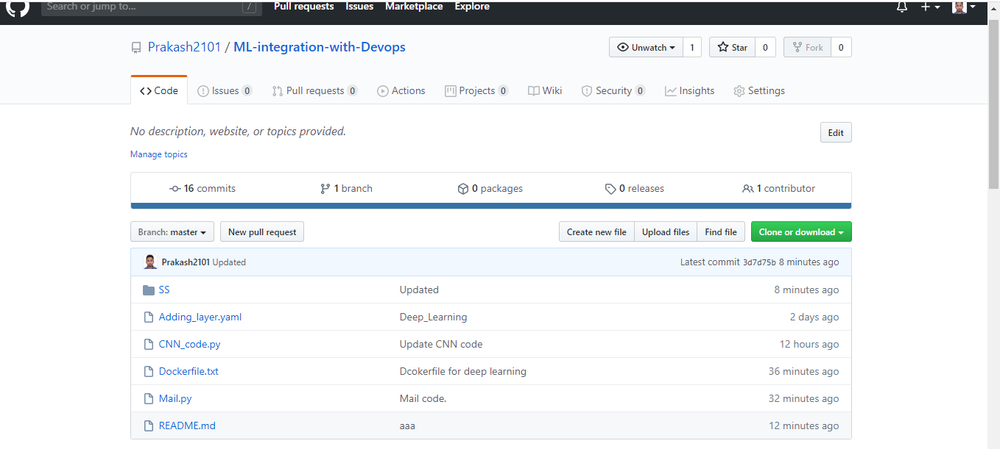
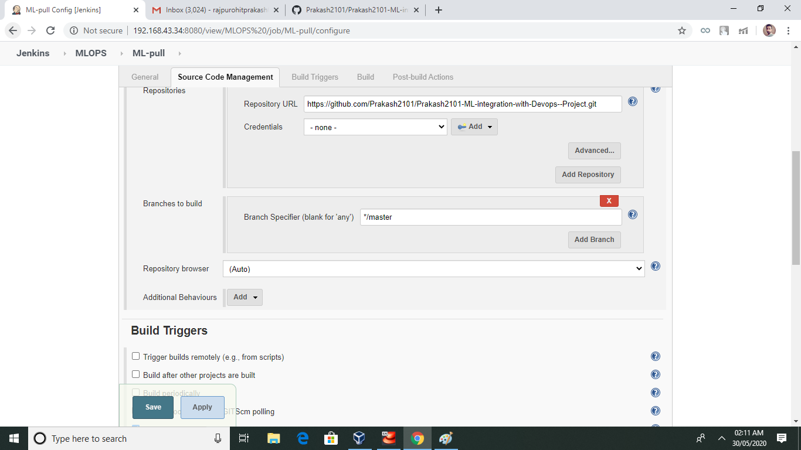
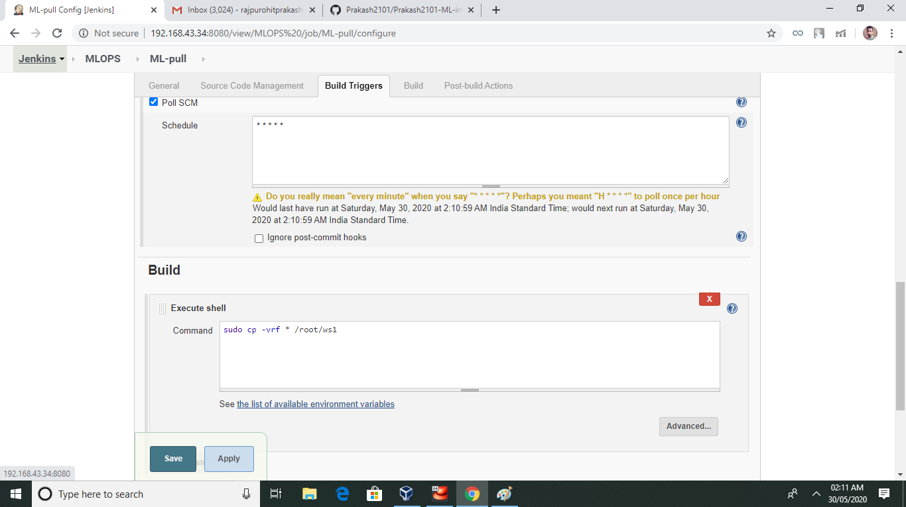
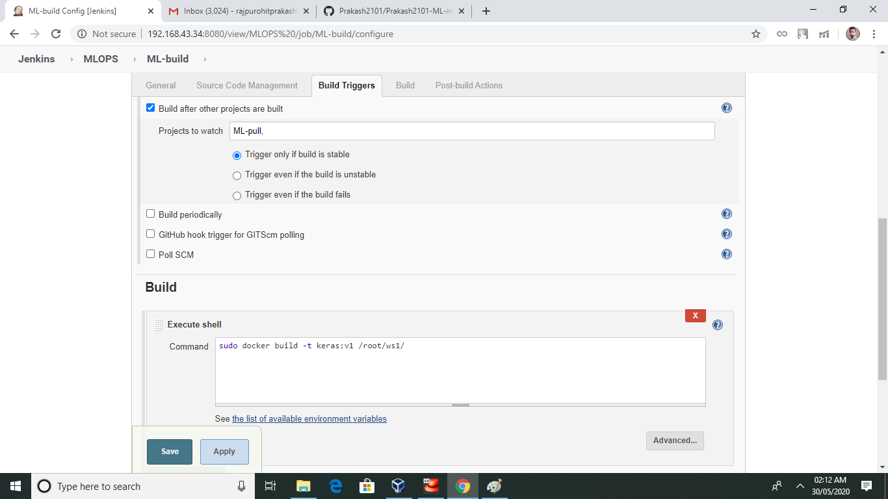
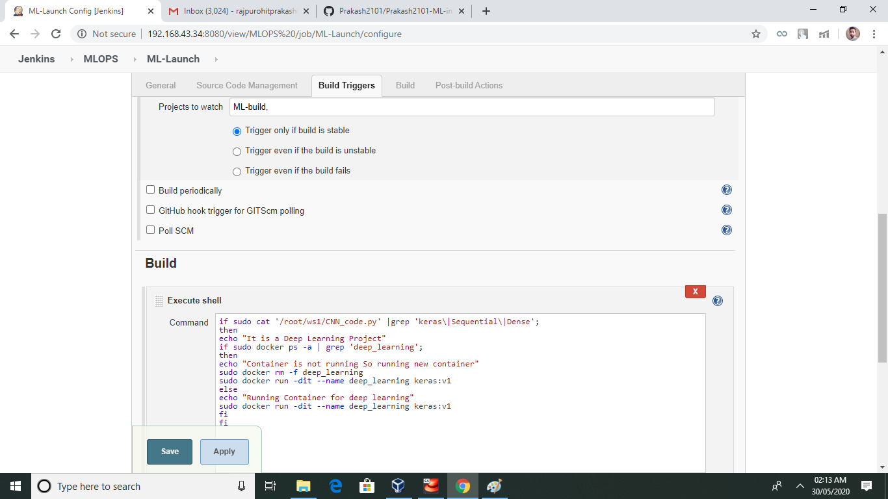
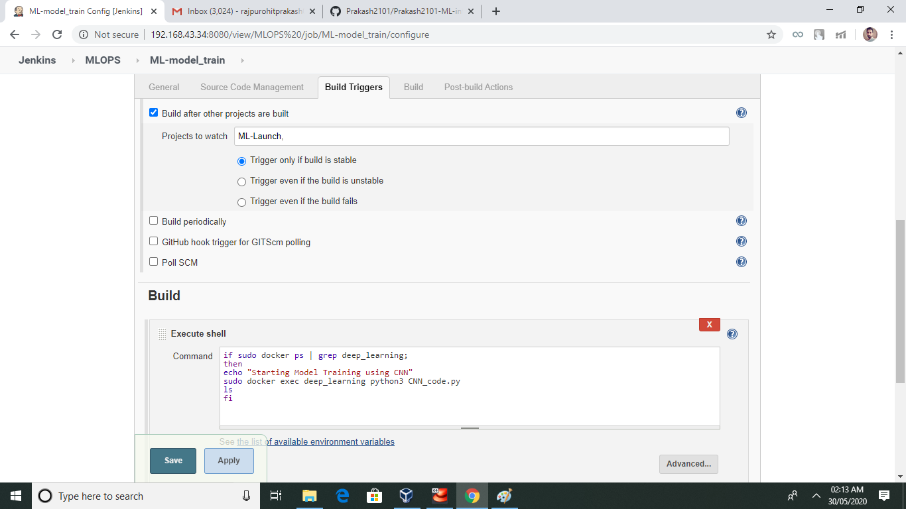
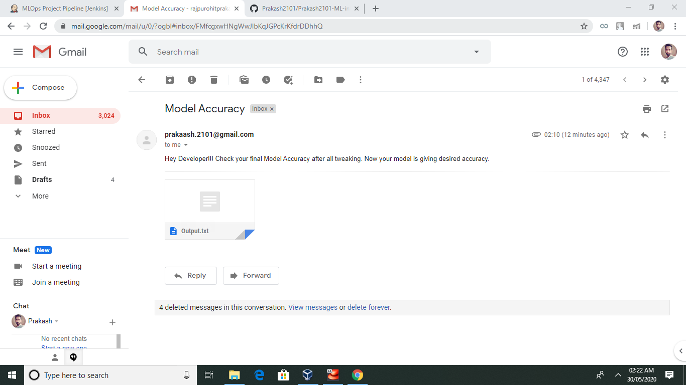
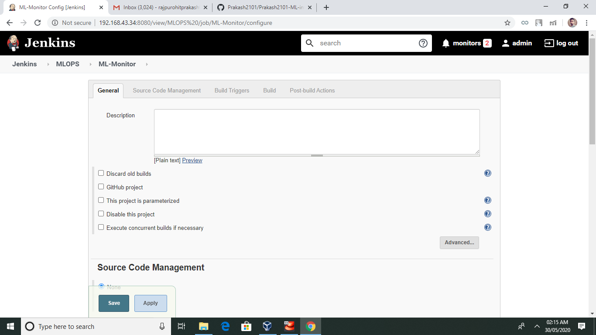

# ML-integration-with-Devops

The goal of any Machine Learning Project is to train a model with high accuracy, for getting high accuracy we need best parameters (bias & weight). But the biggest challenges are:

- 1.	We have to keep eye on the machine learning model whether model gave the desired accuracy or not. If not then we tweak the machine learning model architecture by manually adding some layers like convolutional layer, pulling layer, dense layer, etc. This consume time, energy and delay in project.
- 2.  If system fail/terminate due to any reason so at that time all the hard word we have done is vanished.

So for all this challenges we can take the help DevOps. When Machine Learning is integrated with DevOps our manual work become automated, work become so easy that you have to just give one command it will do all your task. Now you don’t have to monitor anything DevOps will notify you when task is completed and now you can engage yourself in other work.

**In this practical you will come to know how we can integrate Machine Learning with Devops tools i.e. GitHub, Jenkins, Docker.For the practical I am using Base OS REHL – 8 on top of my windows using virtualization technology. Jenkins and Docker is installed in REHL – 8. There is a network connectivity between windows and RHEL – 8 so I am going to use Jenkins in windows chrome. I am using MNIST dataset for this practical.**


# Agenda : 
-	Creating docker container using Dockerfile. 
-	When we launch this image, it should automatically starts train the model in the container.
-	Tweak the machine learning model architecture if desired accuracy not got.
-	Notify the developer when desired accuracy got.
-	Keep monitoring if container fails due to any reason start/launch the container again where the last trained model left.


# Step 1:
- Python code is going to run in docker container in Centos. So saving all python script with .py extension and creating container image that has Python3, keras, numpy, tensorflow, etc. using Dockerfile. Finally uploaded/push on GitHub.

- Dockerfile
```
FROM centos

RUN yum install python36 -y

RUN yum install epel-release -y
RUN yum update -y

RUN curl "https://bootstrap.pypa.io/get-pip.py" -o "get-pip.py"
RUN python3 get-pip.py

RUN pip install setuptools
RUN pip install keras
RUN pip install pillow
RUN pip install scikit-learn
RUN pip install matplotlib
RUN pip install seaborn
RUN pip install pandas
RUN pip install opencv-python
RUN pip3 install tensorflow
RUN pip install pyyaml

COPY CNN_code.py .
COPY Adding_layers.yaml .
COPY Mail.py .
```





# Step 2:
**Now Jenkins play's an important role to integrate docker, Machine Leaning and GitHub.**

- Job1:
    ## When developer push repository to Github. Jenkins Pull the Github repository automatically in Jenkins workspace and copy that in base OS system. 


    


    - Here I used poll scm to pull the repository from GitHub.
    


    ## Job1 run successfully: 
    


- Job2:
    ## Creating a container image in docker using Dockerfile.
    


    - Job2 run successfully, created docker container image keras:v1
    
      
- Job3:
    ## By looking at the code or program file, Jenkins automatically start the respective container that has already installed all the software’s required for processing the code.
    
    
    
    
    - Job3 run successfully, created new container name deep_learning.
    
 
 
 

- Job4:
    ## Execute the code, train the model and predict the accuracy. If metrics accuracy is less than 95%, then it will tweak the machine learning model architecture.
    
    
    - Downloading NMIST dataset from internet:
    
    - Alert!!! we got very less accuracy, not to worry it will tweak the machine learning model architecture,
    
    - Alert again !!! we got very less accuracy, not to worry it will tweak the machine learning model architecture.
    
    - Congratulations !!! we got the desired accuracy.
    
    - Finally model gave the accuracy arround 96%.
     


- Job5:
    ## When model give the desired accuracy it will notify the developer that your model is being created with desired accuracy.
    
    
    - Mail sent succesfully to developer.
    
    
    
    
-Job6:
    ## If container is running and fails due to any reason then Jenkins automatically start the container again.
    
  
    - Job6 run successfully container is working fine.
    


## All Jenkins Job run successfully and we can view in job pipeline.


# For powerfull monitoring and management of container we can integrate this project with kubernetes. I will surely enhance this project in future.
